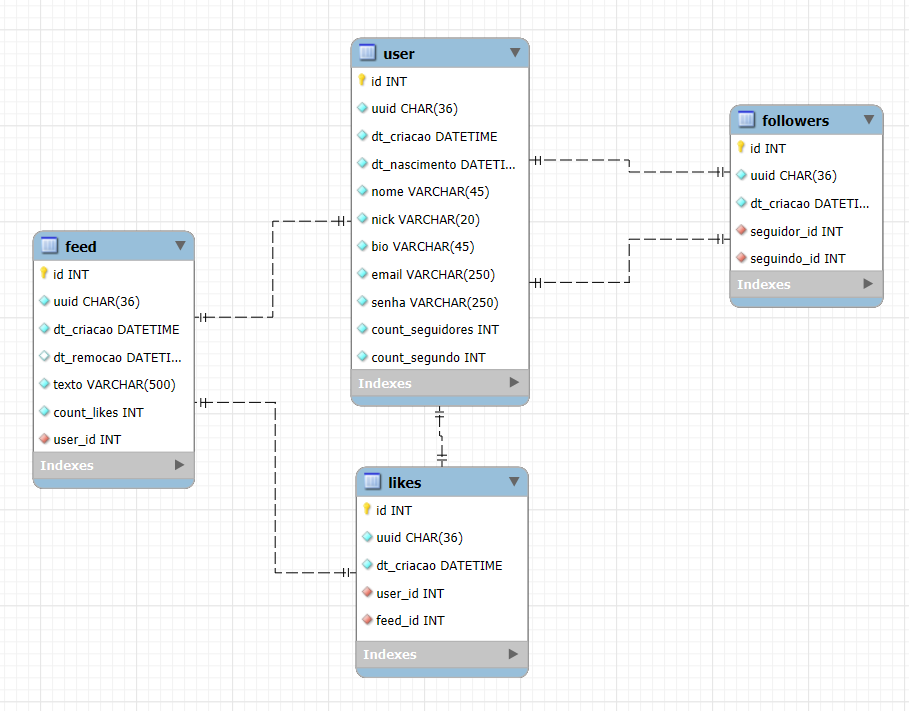

# Projeto para uma Vaga de Programador Python - B2Bit

O projeto irei fazer utilizando o framework Flask, por ter mais familiaridade com ele do que com o DJango

---

### Descrição
O projeto se trata de uma API RESTFUL para um sistema de midia social, onde os usuários poderão:
- [x] Registrar e Autenticar
- [ ] Postagens
    - [x] Criar
    - [ ] Editar
    - [ ] Deletar
- [x] Curtir e Descurtir Postagens
- [ ] Seguir e Deixar de Seguir Outros Usuários
- [x] Visualizar o Feed
    - [ ] (paginação)
- [ ] Mostrar apenas postagens dos usuários seguidos

As Views e Models foram separados em vários arquivos nas suas respectivas pastas para garantir um código mais limpo.

---

### Banco de Dados
* Postgresql 16
* Estrutura desenha no MySQL WorkBench


### Fake-migrate
* No momento apaga o banco inteiro e sobe de novo

Para iniciar o banco basta ir na pasta [src](./src/) e executar o comando
```shell
python3 migrate.py ["config.dev"]
```
O ultimo parametro é opcional e são aceitos:
- "config.dev"
- "config.prod"
- "config.test"

---

### Documentações
- [Documentação Tecnica](./docs/README.md)
- [Estrutura do Projeto](./docs/estrutura_projeto.md)

---

### Execução
#### Docker
1. Acessar a pasta raiz do projeto (Onde está localizado o [dockerfile](./dockerfile) e o [docker-compose.yml](./docker-compose.yml))
2. Abrir o terminal e Digitar o comando
```shell
docker-compose up
```
3. Feito isso o sistema já estará funcionando nas portas 80 para o servidor backend da aplicação e 5432 para o DB PostgresSQL.
4. Caso deseje mudar a porta, basta editar o arquivo [docker-compose.yml](./docker-compose.yml) alterando a porta da esquerda no atributo ports, exemplo se quiser mudar a porta do servidor para a porta 50...
```yml
desafio_b2bit_api:
    build: "."
    depends_on: 
        - desafio_b2bit_db
    container_name: desafio_b2bit_api
    ports:
        - "50:80"
    networks: 
        - desafio_b2bit_network
```

#### Python
Para executar diretamente no python é necessário ter um banco de dados Postgres ou MySQL rodando na maquina

1. Acessar a pasta raiz do projeto (onde está localizado o [requirements.txt](./requirements.txt))
2. Abrir o terminal e digitar (a parte do ambiente é opcional)
##### Windows
```shell
python -m venv .env
.env\scripts\activate
python -m pip install -U pip
pip install -r requirements.txt
```
##### Linux ou Mac
```shell
python -m venv .env
source .env/scripts/activate
python -m pip install -U pip
pip install -r requirements.txt
```
3. Acessar a pasta [src](./src/) (onde fica o codigo fonte do projeto) e executar o seguinte comando no terminal
```shell
python app.py
```
4. Para realizar os testes basta executar os seguintes comandos
```shell
pip install -r requirements.txt
pip install pytest
pytest
```
5. Caso deseje alterar alguma configuração do banco (como porta, senha, ou host) ou a chave da API basta acessar a pasta [config](./src/config/) e alterar algum dos arquivos (conforme o profile desejado):
    - [base.py](./src/config/base.py) - Todos os profiles são baseados nele
    - [dev.py](./src/config/dev.py) - Profile para desenvolvimento e Docker
    - [test.py](./src/config/test.py) - Profile para testes unitários
    - [prod.py](./src/config/prod.py) - Profile para produção